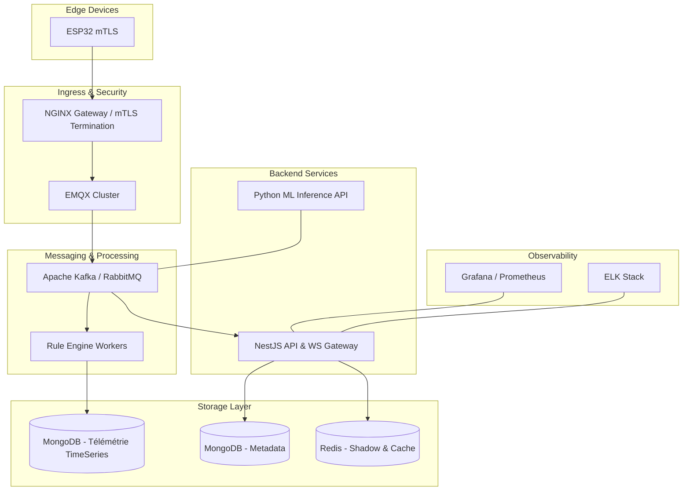

# 🏢 Blueprint Enterprise IoT SaaS : Architecture Haute Disponibilité (Smart Shepherd)

Ce document constitue la spécification architecturale ultime pour transformer **Smart Shepherd** en une plateforme IoT SaaS de niveau entreprise. Il définit les standards de sécurité, de performance et de scalabilité requis pour gérer des flottes de plus de 10 000 appareils en production réelle.

---

## 1. Architecture de Messagerie Modulaire (Scalable Broker)

Le choix de l'infrastructure de messagerie dépend du volume de données et de la criticité de la rétention.

### 🌓 Option A : RabbitMQ (Échelle < 2 000 devices)
- **Avantages** : Facilité de configuration, gestion fine des priorités, routage complexe via exchanges.
- **Usage** : Idéal pour un MVP ou une flotte régionale. Recommandé pour la gestion des commandes (RPC) et des alertes immédiates.

### 🌕 Option B : Apache Kafka (Échelle > 10 000 devices)
- **Avantages** : Débit massif (Millions de msg/s), persistance native (replayability), streaming processing (Kafka Streams).
- **Usage** : Indispensable pour l'analytics de masse et la rétention de données brutes sur de longues périodes sans impact sur les performances.

> [!TIP]
> **Recommandation Enterprise** : Utilisez **Kafka** comme colonne vertébrale pour l'ingestion de la télémétrie et **RabbitMQ** en parallèle pour la gestion des commandes critiques vers les appareils.

---

## 2. WebSocket Gateway & Scalabilité Horizontale

Pour supporter des milliers de connexions UI simultanées, le backend WebSocket doit être scalable horizontalement.

- **WebSocket Gateway (NestJS)** : Utilisation de NestJS pour créer des passerelles dédiées, isolant la logique de flux de la logique métier API.
- **Redis Pub/Sub (Scaling)** : Intégration du `socket.io-redis` adapter. Lorsqu'un message IoT arrive sur l'instance A, Redis le propage aux instances B et C, garantissant que l'utilisateur reçoit l'info quel que soit le serveur sur lequel il est connecté.
- **Sticky Sessions** : Configuration indispensable au niveau de l'Ingress (NGINX/Kong) pour maintenir la connexion socket sur la même instance.

---

## 3. Sécurité Device & Provisioning (mTLS)

La sécurité au niveau de l'appareil est le point le plus critique. Aucun mot de passe ne doit circuler.

- **Authentification mTLS (Mutual TLS)** : Chaque ESP32 possède son propre certificat unique signé par une autorité de certification (CA) privée. Le broker EMQX valide ce certificat lors de la connexion.
- **Flux de Provisioning Scénarisé** :
    1.  L'ESP32 génère une paire de clés privée/publique lors du premier démarrage (Secure Boot).
    2.  Il envoie une **CSR (Certificate Signing Request)** via une connexion temporaire sécurisée.
    3.  Le service de Provisioning valide le `Hardware ID` et renvoie le certificat signé.
- **Hardware Security** : Activation impérative du **Secure Boot** et du **Flash Encryption** sur l'ESP32.

---

## 4. Architecture des Données Unifiée (MongoDB Enterprise)

Pour garantir une simplicité opérationnelle tout en supportant une charge industrielle, nous exploitons la puissance native de MongoDB.

### MongoDB Time Series Collections
Plutôt que d'ajouter une base de données temporelle externe (TSDB), nous utilisons les collections **Time Series** de MongoDB (version 5.0+).

- **Optimisation native** : MongoDB compresse les données temporelles en interne, réduisant l'espace disque et accélérant les lectures IO.
- **Configuration critique** :
    - **Granularity** : Doit être alignée sur la fréquence d'envoi des ESP32 (ex: `seconds`).
    - **MetaField** : Utiliser le `device_id` ou le `tenant_id` comme champ de métadonnées pour regrouper les données d'un même capteur de manière efficace.
- **Data Lifecycle (TTL)** : Utilisation de `expireAfterSeconds` sur la collection temporelle pour une purge automatique des données anciennes sans coût CPU.

> [!IMPORTANT]
> **Sharding IoT** : Pour les flottes dépassant 5 000 devices, activez le sharding sur le `metaField` (`device_id`) pour distribuer la charge d'écriture sur plusieurs serveurs MongoDB sans perdre en performance de lecture.

---

## 5. Digital Twin & Intelligence Prédictive

### Le Jumeau Numérique (Digital Twin)
- **Redis State Cache** : Stockage de l'état actuel (Device Shadow) pour un accès à latence < 1ms.
- **Historique & Replay** : Capacité de rejouer les mouvements d'un animal en interrogeant les collections Time Series de MongoDB.
- **Simulation** : Prédire la trajectoire d'un animal en cas de perte de signal GPS.

### IA Prédictive & Maintenance
- **Maintenance Prédictive** : Algorithme calculant la dégradation de la batterie.
- **Détection de Maladie** : Analyse des micro-variations de température via un modèle LSTM.

---

## 6. Observabilité & Monitoring Enterprise

- **Prometheus + Grafana** : Monitoring des performances système.
- **Stack ELK (Elasticsearch, Logstash, Kibana)** : Centralisation des logs applicatifs.
- **Alerting Automatique** : Configuration de seuils de latence ou d'erreurs (PagerDuty/Slack).

---

## 7. Performances Frontend (Rendu Haute Densité)

- **Leaflet Canvas Rendering** : Utilisation du mode `L.canvas()` pour supporter 1000+ marqueurs sans lag.
- **Gestion d'état Atomique** : Utilisation de **Zustand** pour éviter les re-renders globaux.

---

## 8. Résilience & Robustesse Business

- **Circuit Breaker** : Utilisation de librairies comme `Opossum`.
- **RBAC Avancé** : Gestion granulaire des droits (Admin, Eleveur, Vétérinaire).
- **Multi-Tenant Isolation** : Filtrage systématique par `tenant_id` au niveau des requêtes MongoDB.

---

## 9. Synthèse du Déploiement Cloud Enterprise

